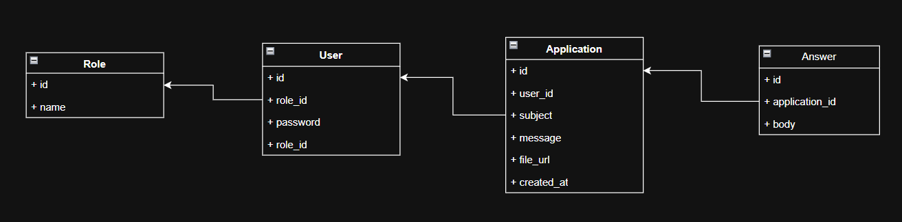

<p align="center"><a href="https://laravel.com" target="_blank"></a></p>


## Proyekt

Bu loyiha menejer va mijozlarni bog'laydi \
Mijozlar o'z arizalarini qoldiradi \
Menejer esa arizalarni o'qib ularga javob qaytaradi

## Loyihani ishga tushirish
```
 composer install
 npm install
 npm run dev
 .env faylini sozlash
 php artisan key:generate
 php artisan migrate

```
## Foydalanuvchi
- User: manage@company.com
- Password: secret 

## Ma'lumotlar bazasi  Strukturasi


## License

The Laravel framework is open-sourced software licensed under the [MIT license](https://opensource.org/licenses/MIT).
